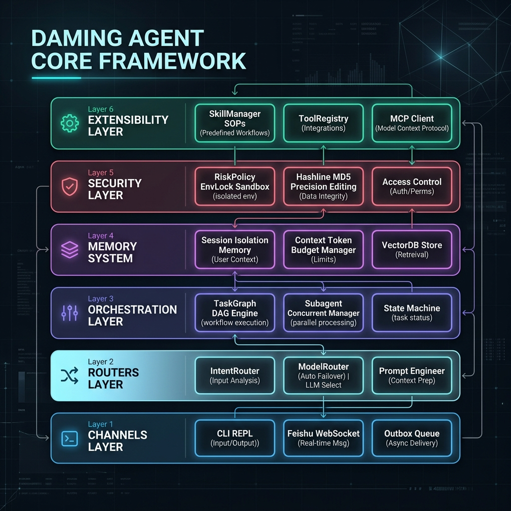

# 🚀 Daming Agent - 工业级通用自主 AI Agent 框架
> **Industrial-Grade Universal Autonomous AI Agent Framework**

[](https://www.python.org/)
[](LICENSE)
[](https://github.com/dylanma8232-art/Daming-Agent/releases/tag/v1.0.0)
[](https://github.com/dylanma8232-art/Daming-Agent/issues)

[中文](#-中文) | [English](#-english)

---

## 🇨🇳 中文

### 🏛️ 1. 什么是 Daming Agent 框架？

**Daming Agent** 是一个模块化、解耦、自带工业级防护与多代理编排的 **Python AI Agent 核心框架**。

它为开发者和团队提供了一套完整的 **Agent 运行时 (Runtime)**，解耦了模型层、记忆层、编排层、安全防护层与渠道层，内置了从 **动态意图裁剪、DAG 任务编排、多子代理并发、长短期记忆** 到 **物理沙箱防护与飞书长连接** 的全套工程化组件。




---

### 🧩 2. 8 大底层核心组件架构 (Framework Core Components)

1. **ReAct & IntentRouter (动态意图路由器)**：根据用户输入的意图分类，自动按需裁剪无关 Tool Schema，将上下文 Token 消耗降低 60%。
2. **TaskGraphManager (DAG 任务图编排引擎)**：解耦“规划 (Plan)”与“执行 (Execute)”，支持构建复杂多步骤拓扑图，自动分派 `supervisor`、`executor` 与 `reviewer` 节点。
3. **SubagentManager (多代理并发调度器)**：支持主 Agent 在后台衍生多个独立并行子代理（Subagents），通过 SQLite 进行状态快照与任务回收。
4. **ModelRouter (多模型路由与自动熔断)**：支持 API 或对话动态注册新模型；遇到网络断连或 504 超时，自动秒级无感降级切换至备用模型链。
5. **Hashline (MD5 行哈希防改砸编辑器)**：写入大文件前强制对目标代码段进行 MD5 行签名校验，解决大模型行号漂移导致的改串行事故。
6. **RiskPolicy & EnvLock (物理目录手刹)**：基于静态 AST 编译分析与物理路径锁，严格限制越权修改 `.env` 密钥文件与危险 Terminal 命令。
7. **Memory & Context Pipeline (三层记忆管线)**：按 `session_id` 物理隔绝会话上下文，结合基于中英文 N-gram 的长期记忆召回与滑动窗口压缩。
8. **Skills & MCP Protocol (生态扩展接口)**：原生支持 Markdown SOP 专家技能包（`SKILL.md`）与标准 MCP (Model Context Protocol) 客户端集成。

---

### 💡 3. 解决什么工程痛点？

- **消除长任务跑偏失控**：支持长任务执行中途**实时插队干预 (Mid-Flight Steering)**，人类发送新消息 Agent 自动在线“掉头”，无需强杀进程或废弃上下文。
- **消除代码改砸噩梦**：使用 MD5 行哈希（Hashline）校对目标代码块，行号漂移时自动拒绝写入并重新精确定位，代码改砸率归零。
- **消除 API 波动导致的前功尽弃**：遇到模型 504 超时或断连时，自动降级切换至备用模型，保障长流式任务 100% 成功保活。

---

### 💻 4. 开发者 SDK 代码示例 (Developer Examples)

#### 作为 Python 库直接调用 Agent
```python
from daming_agent.agent import LocalAgent

agent = LocalAgent()

# 运行任务
response = agent.reply_message_stream("请分析 src/ 目录的代码结构并输出重构建议")
print(response.content)
```

#### 动态构建 TaskGraph DAG 任务图
```python
from daming_agent.task_graph import TaskGraphManager

manager = TaskGraphManager(agent.runtime_store)
graph = manager.create_graph(
    session_id="session_01",
    nodes=[
        {"id": "n1", "objective": "抓取最新科技新闻", "role": "researcher"},
        {"id": "n2", "objective": "撰写分析报告", "role": "writer", "dependencies": ["n1"]},
    ]
)
```

---

### 📦 5. 安装与快速上手

```bash
# 一键安装
pip install git+https://github.com/dylanma8232-art/Daming-Agent.git

# 配置文件
cp .env.example .env
```

编辑 `.env`：
```env
CLOUD_BASE_URL=https://dashscope.aliyuncs.com/compatible-mode/v1
CLOUD_API_KEY=your_api_key_here
CLOUD_MODEL=qwen3.7-plus
```

启动：
```bash
python app.py
```

---

## 🇬🇧 English

### 🏛️ 1. What is Daming Agent Framework?

**Daming Agent** is a modular, decoupled Python **AI Agent Core Framework** equipped with multi-agent orchestration and industrial security guardrails.

It provides developers with a full **Agent Runtime**, decoupling the model layer, memory layer, orchestration layer, security layer, and channel layer.


---

### 🧩 2. Core Architecture Components

1. **ReAct & IntentRouter**: Dynamically filters unused tool schemas based on intent classification, reducing prompt tokens by up to 60%.
2. **TaskGraphManager (DAG Engine)**: Decouples planning from execution, building DAG topology graphs with `supervisor`, `executor`, and `reviewer` nodes.
3. **SubagentManager (Parallel Orchestrator)**: Spawns and manages parallel sub-agents in the background with SQLite state snapshots.
4. **ModelRouter (Failover Engine)**: Dynamic model registration with seamless failover to backup model chains upon timeouts or 5xx failures.
5. **Hashline Precision Editor**: Mandatory MD5 line-level checksum verification on every file edit, eliminating line-drift code corruption.
6. **RiskPolicy & EnvLock**: AST static code analysis + physical directory locks to prevent credential leaks and bad write operations.
7. **Memory & Context Pipeline**: Session-isolated memory with N-gram keyword recall and rolling history token budget management.
8. **Skills & MCP Protocol**: Native support for Markdown SOP skills (`SKILL.md`) and standard Model Context Protocol (MCP) clients.

---

### 💻 3. Developer Usage Examples

```python
from daming_agent.agent import LocalAgent

agent = LocalAgent()
response = agent.reply_message_stream("Analyze project structure and generate report")
print(response.content)
```

---

### 📦 4. Installation & Setup

```bash
pip install git+https://github.com/dylanma8232-art/Daming-Agent.git
cp .env.example .env
python app.py
```

---

## ⚖️ 许可证 License

[GNU AGPL v3.0](LICENSE) — 个人学习与非商业研究免费使用。商业产品集成或 SaaS 服务使用必须开源对应代码。

Free for non-commercial research. Commercial deployments require open-sourcing under AGPL.

## 🤝 社区 Community

欢迎提交 [GitHub Issues](https://github.com/dylanma8232-art/Daming-Agent/issues) 反馈问题或建议！
Found a bug or have an idea? Feel free to open an [Issue](https://github.com/dylanma8232-art/Daming-Agent/issues)!
