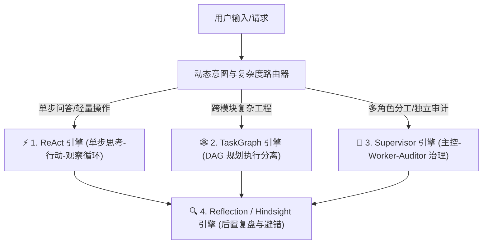

# 🚀 Daming Agent - 工业级通用自主 AI Agent 框架
> **Industrial-Grade Universal Autonomous AI Agent Framework**

[](https://www.python.org/)
[](LICENSE)
[](https://github.com/dylanma8232-art/Daming-Agent/issues)

[中文版](#-中文版-项目介绍) | [English Version](#-english-version-project-overview)

---

## 🇨🇳 中文版 项目介绍

### 💡 为什么选择 Daming Agent？

**Daming Agent** 是一个解耦、高安全性、具备 4 大认知引擎与工业级防错机制的通用自主 AI Agent 底座。

传统的 Agent 框架在真实长链条复杂任务中往往面临 **“代码改砸”、“越权乱删文件”、“模型超时崩溃”** 以及 **“方向跑偏必须重头来过”** 的痛点。Daming Agent 通过**哈希校对、物理手刹锁、熔断切线与中途插队**等核心创新，彻底解决了这些工程痛点。

---

### 🌟 6 大核心杀手级亮点 (Killer Features)

| 核心特性 | 运作原理与工程优势 |
| :--- | :--- |
| 🛡️ **Hashline 哈希防改砸编辑** | 每次修改大文件代码前强制 MD5 行签名校验，杜绝因为行号漂移导致的代码改砸事故。 |
| 🛑 **EnvLock 物理目录安全锁** | AST 静态安检门控制，核心路径加锁，防范 Agent 越权修改或误删重要代码。 |
| 🔀 **中途实时插队干预 (Mid-flight Steering)** | 任务跑中途，人类可随时发送/引用消息重新指定要求，Agent 无感在线“掉头”，无需杀进程。 |
| 🧠 **4 大认知引擎矩阵 (4 Cognitive Engines)** | 融合 **ReAct** (即时循环)、**TaskGraph DAG** (规划执行分离)、**Reflection** (复盘反思) 与 **Hierarchical Supervisor** (分层主从治理)。 |
| ⚡ **模型故障自动熔断降级 (Automatic Failover)** | 模型连线超时或 5xx 故障时，系统自动捕获并在容灾链中熔断切换至备用模型，任务绝不中断。 |
| 💬 **全渠道打字机与单表情交互 (Universal Channels)** | 原生支持 CLI 终端与飞书 WebSocket 长连接 Bot（含 300ms 动态防抖、单表情独占状态与完成态按钮）。 |

---

### 🏛️ 4 大认知引擎架构图



---

### ⚡ 5 分钟快速上手 (QuickStart)

#### 1. 克隆仓库与安装依赖
```bash
git clone https://github.com/dylanma8232-art/Daming-Agent.git
cd Daming-Agent
pip install -r requirements.txt
```

#### 2. 配置环境变量
```bash
cp .env.example .env
# 编辑 .env 填写你的大模型 API Key
```

#### 3. 运行体验
```bash
# 启动 CLI 交互模式
python main.py
```

---

## 🇬🇧 English Version: Project Overview

### 💡 Why Daming Agent?

**Daming Agent** is an uncoupled, highly secure, universal autonomous AI Agent framework equipped with **4 Cognitive Engines** and industrial-grade error-prevention primitives.

Existing agent frameworks often suffer from **code drift corruption, unauthorized directory access, API timeout crashes, and rigid execution paths**. Daming Agent overcomes these limitations via **Hashline Line Checksums, EnvLock Physical Protection Gates, Automatic Failover, and Mid-flight Steering**.

---

### 🌟 Key Architectural Highlights

- 🛡️ **Hashline Collision-Proof Edits**: MD5 line-level checksum verification prevents line-drift code corruption during large file edits.
- 🛑 **EnvLock Physical Protection Gate**: Enforces directory-level locks to prevent unauthorized file deletion or write overreach.
- 🔀 **Mid-Flight Steering**: Allows live human intervention mid-loop. Direct the agent to pivot without killing the process or losing context.
- 🧠 **4 Cognitive Engine Suite**: Combines **ReAct**, **TaskGraph DAG** (Plan-and-Execute), **Reflection** (Hindsight Learning), and **Hierarchical Supervisor** (Master-Worker-Auditor governance).
- ⚡ **Dynamic Model Failover**: Automatically detects API timeouts or 5xx disconnects and fails over to backup models seamlessly.
- 💬 **Universal Channel Adapters**: Native support for CLI REPL and Feishu WebSocket Bots (with 300ms patch debouncing, exclusive reactions, and interactive cards).

---

## ⚖️ 开源许可证与使用规范 (License & Commercial Terms)

本项目遵循 **[PolyForm Noncommercial License 1.0.0](LICENSE)** 开源协议。

- 免费用于**个人学习、科研与非商业性探索**。
- **未经版权所有者明确书面授权，严禁将本项目源码或衍生版本用于任何商业用途、商业获利或商业产品集成。**

如需商业授权或合作，请联系项目作者。

---

## 🤝 开源共创与 Community Co-Creation

本项目欢迎社区开发者共同建设与完善！
- 🐛 **发现 Bug 或需求？** 欢迎直接提 [GitHub Issues](https://github.com/dylanma8232-art/Daming-Agent/issues)！作者会第一时间响应并积极修复维护。
- 🔀 **代码贡献？** 欢迎提交 Pull Request (PR)。

---
*Built with ❤️ by dylanma8232-art. Empowering AI Agents to execute safely in the real world.*
